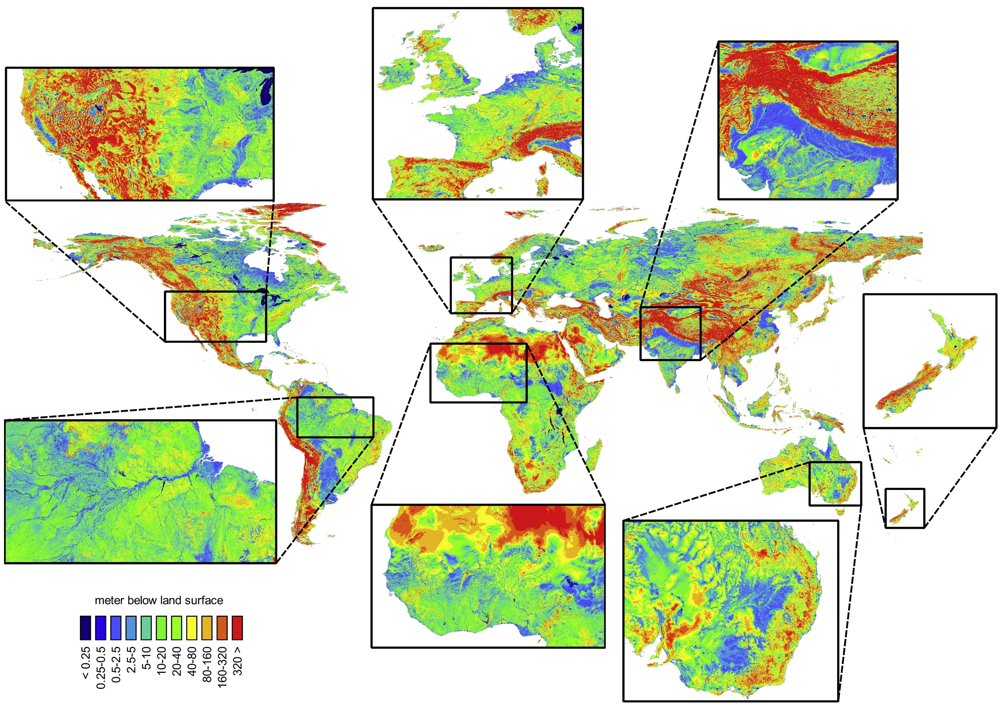

# GLOBGM

The GLOBGM is the PCR-*GLOB*WB MODFLOW global-scale *G*roundwater *M*odel at 30 arcsecond spatial resolution (~ 1km at the equator) that makes usage of high performance computing. The current version 1.0 uses off-line data from [PCR-GLOBWB](https://globalhydrology.nl/research/models/pcr-globwb-2-0/). For simulating steady-state or transient groundwater flow, a new distributed memory parallel prototype of MODFLOW 6 is being used, that has been developed together with the United States Geological Survey (https://github.com/verkaik/modflow6-parallel.git, https://doi.org/10.5281/zenodo.5778658).

Contact: Jarno Verkaik (globgm.info@gmail.com)

GLOBGM main reference/paper: Verkaik, J., Sutanudjaja, E. H., Oude Essink, G.H.P., Lin, H.X., and Bierkens, M. F. P.: GLOBGM v1.0: a parallel implementation of a 30 arcsec PCR-GLOBWB-MODFLOW global-scale groundwater model, Submitted to Geosci. Model Dev., September 2022.

PCR-GLOBWB main reference/paper: Sutanudjaja, E. H., van Beek, R., Wanders, N., Wada, Y., Bosmans, J. H. C., Drost, N., van der Ent, R. J., de Graaf, I. E. M., Hoch, J. M., de Jong, K., Karssenberg, D., López López, P., Peßenteiner, S., Schmitz, O., Straatsma, M. W., Vannametee, E., Wisser, D., and Bierkens, M. F. P.: PCR-GLOBWB 2: a 5 arcmin global hydrological and water resources model, Geosci. Model Dev., 11, 2429-2453, https://doi.org/10.5194/gmd-11-2429-2018, 2018.

## Input and output data files (including Yoda access)

The main GLOBGM input and output data files are available through the [Yoda](https://www.uu.nl/en/research/yoda) research data management service:

- URL: https://geo.data.uu.nl/research-globgm/
- Username: globgm.user@gmail.com
- Password: globgm.user.2022

Note that among the available raster files provided by Yoda, there are files with the IDF (iMOD Data File) extension. These binary files can be viewed and processed using [iMOD](https://oss.deltares.nl/web/imod/download-imod5).

## How to install

For the 'Write Tiled Parameter Data' pre-processing, PCR-Raster Python should be installed, see steps 1-3 in 'How to install' section at the [PCR-GLOBWB](https://github.com/UU-Hydro/PCR-GLOBWB_model) GitHub repository. For this pre-processing, the modified PCR-GLOBWB Python model files are located in [model_tools_src/python/pcr-globwb/](model_tools_src/python/pcr-globwb/).

The GLOBGM pre-processing steps 'Prepare Model Partitioning' and 'Partition and Write Model Input' require the Fortran compilation (e.g. using [Intel](https://www.intel.com/content/www/us/en/developer/tools/oneapi/fortran-compiler.html#gs.hn3ht0) or [GNU](https://gcc.gnu.org/fortran/)) of the tools located in [model_tools_src/fortran/](model_tools_src/fortran/). Note that for some of these tools (i.e. *catchcreatemetis*, *mf6ggm*) the code should be linked with [METIS](http://glaros.dtc.umn.edu/gkhome/metis/metis/download). For this, METIS should be compiled at 64-bit precision (see [model_tools_scr/c/metis/metis.h](/model_tools_src/c/metis/metis.h)). 

For running the model ('Run Model') the parallel MODFLOW 6 code should be compiled with a Fortran compiler and linked with the Message Passing Interface library (see e.g. the template [model_tools_src/fortran/modflow6/makefile](model_tools_src/fortran/modflow6/makefile)).

## How to run

The model input files for the tools can be found in [model_input](model_input/), and templates for the job scripts in [model_job_scripts](model_job_scripts/). The folder structure closely follows the steps of the GLOBGM workflow, as described in Section 2.3 of the GLOBGM paper (Verkaik et al., 2022). In the input files, including file names, we use the following variables/names that should changed by the user:

- *{yoda_input}*: Yoda location https://geo.data.uu.nl/research-globgm/input/version_1.0/
- *{yoda_output}*: Yoda location https://geo.data.uu.nl/research-globgm/output/version_1.0/
- *{bin_dir}*: directory with all compiled Fortran programs
- *{git_dir}*: root directory of this GitHub repository 
- *{map_dir}*: directory of tiled parameter data as a result of 'Write Tiled Parameter Data' pre-processing
- *{globgm_dir}*: root model directory of the GLOBGM 
- *{pft_lev}*: HydroBASINS Pfafstetter level for catchment partitioning. Valid are: '05', '06' or '08'.

For post-processing, two main tools are provided:

- *mf6ggmpost*: Fortran tool to read GLOBGM output for MODFLOW and write heads or watertable depths, aggegrated data such as head decline slope, and sampled time series 
- *analyze_gw_head:* R-script used for evaluating the transient GLOBGM results for the CONUS using NWIS observation wells (see Section 3.3 of Verkaik et al., 2022). See [model_evaluation](model_valuation/) for corresponding input and output. This script it a modified version of [de Graaf et al. (2017)](https://doi.org/10.1016/j.advwatres.2017.01.011).

## Example output
Computed steady-state water table depths using the GLOBGM (Figure 14a from Verkaik et al., 2022; *{yoda_output}*/steady-state/globgm-wtd-ss.tif). 

## Disclaimer

The GLOBGM is released under the GPL license v3.0 (see [LICENSE](LICENSE)). All data and software provided with this model come with ABSOLUTELY NO WARRANTY.
